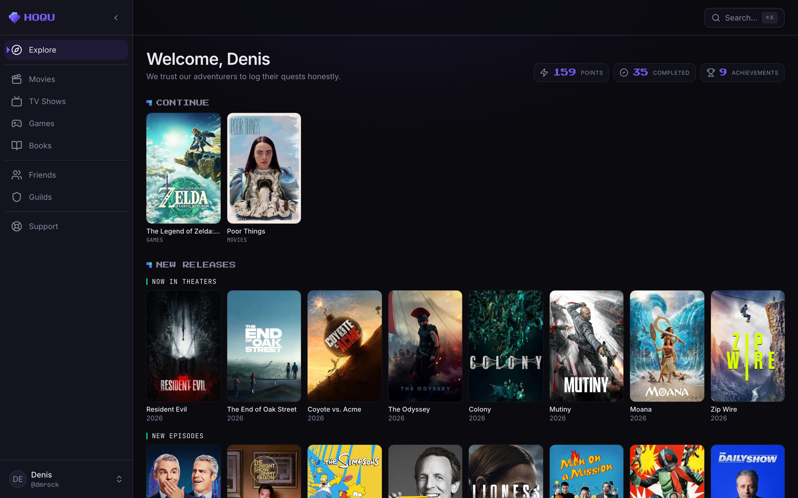
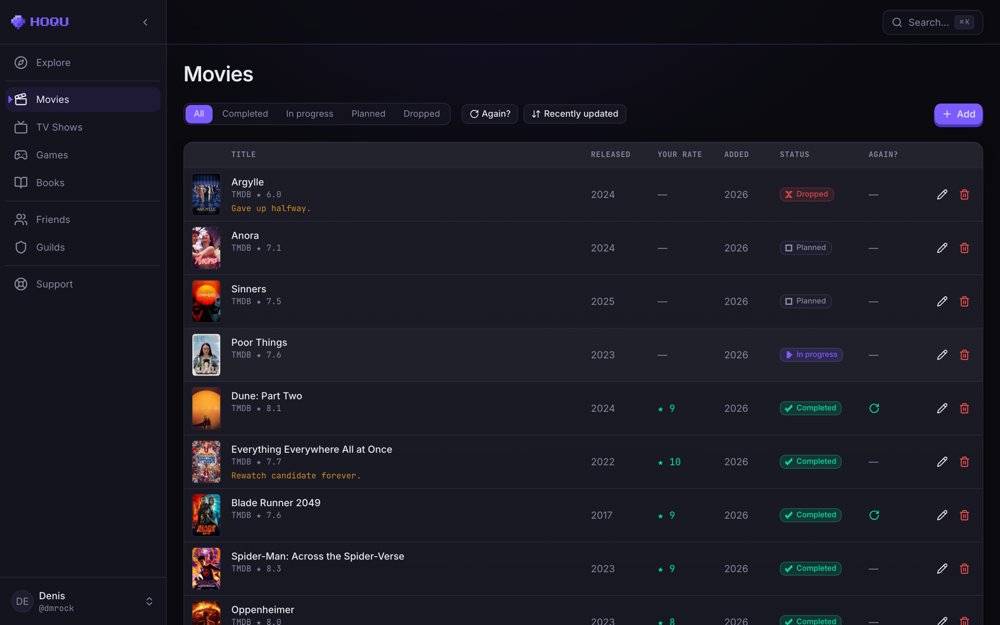
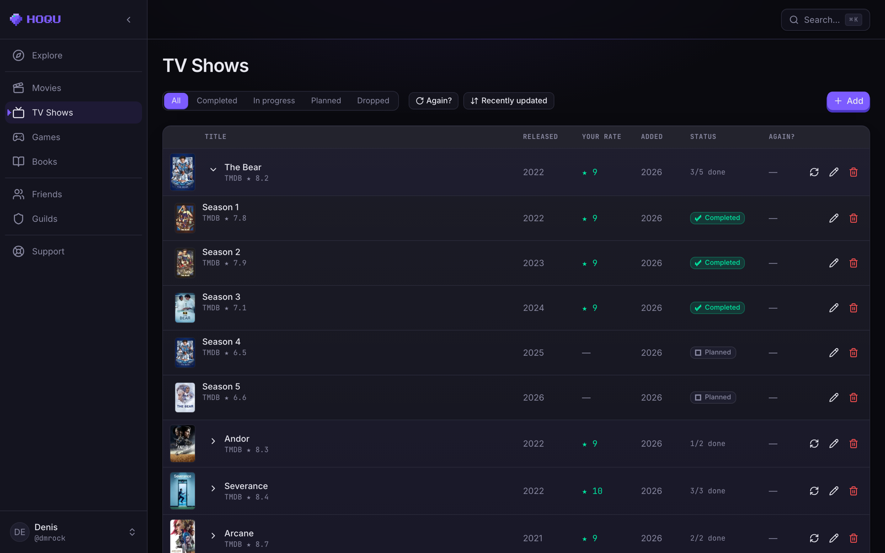
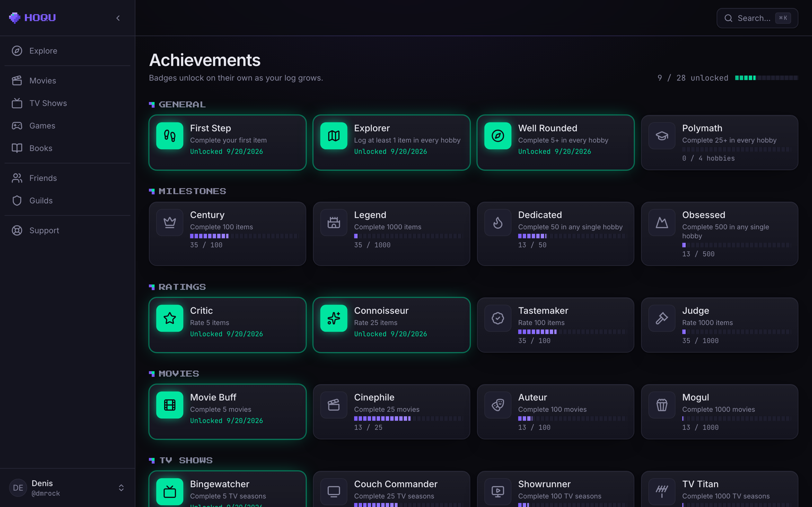
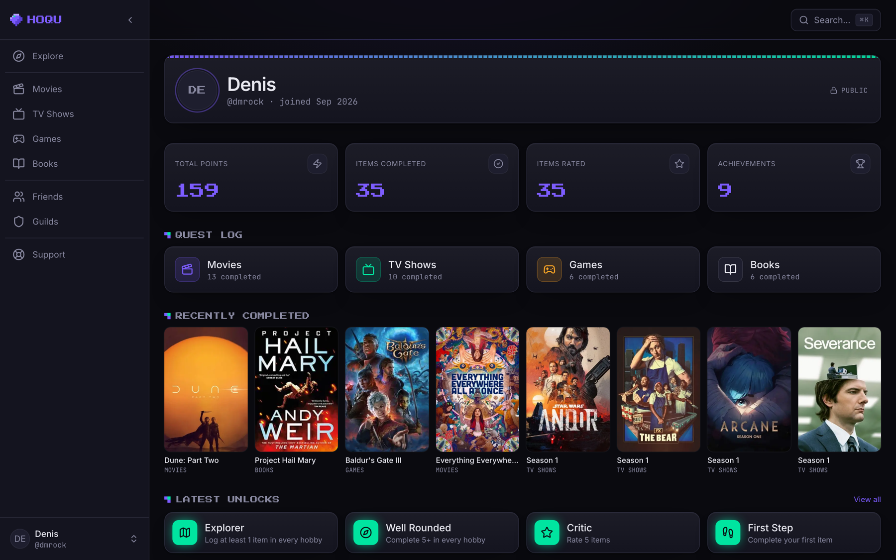
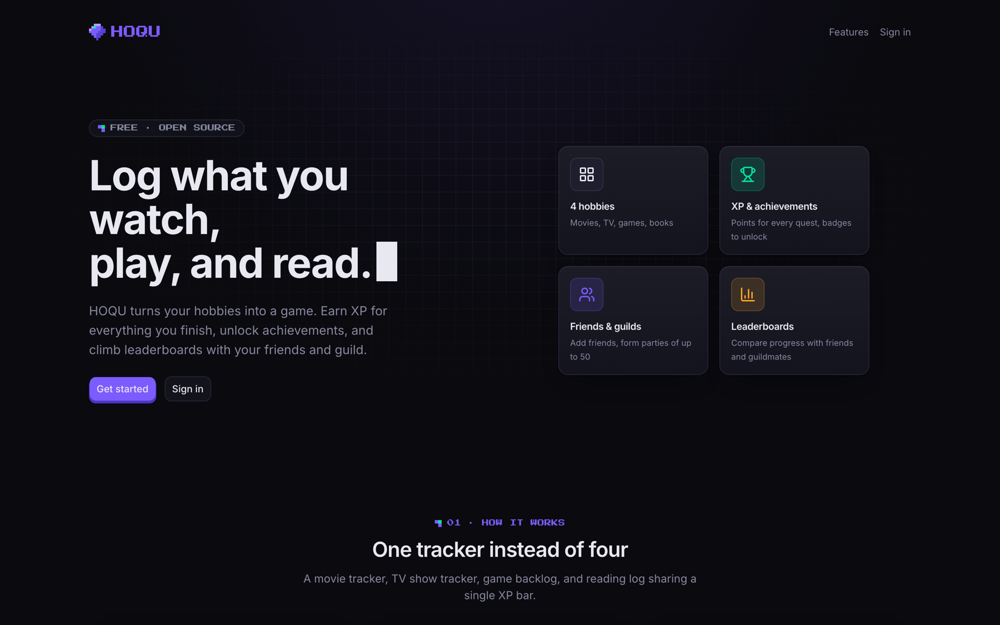
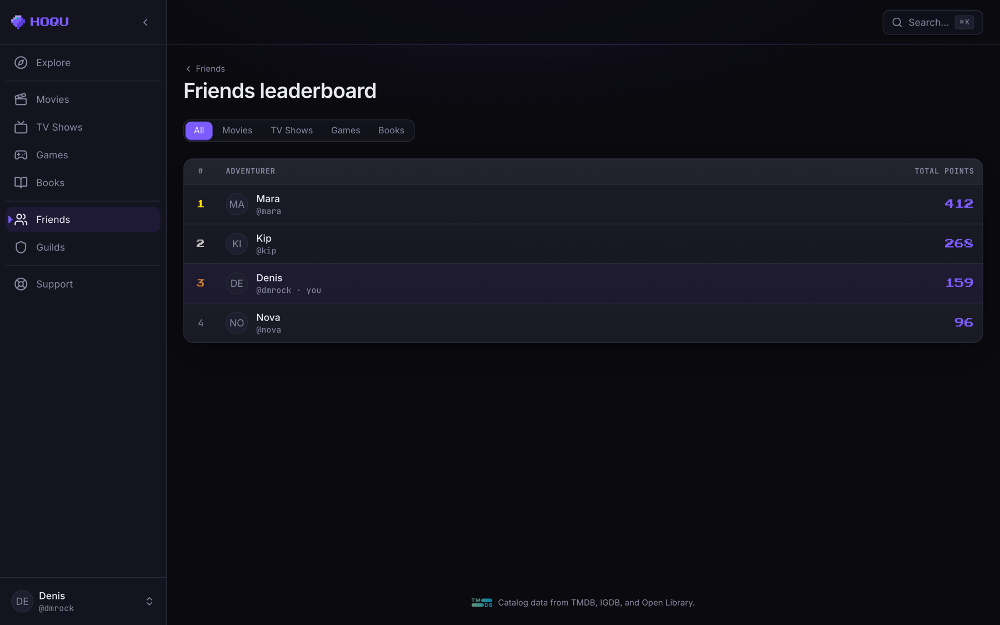

# HOQU

A hobby tracker where you log movies, TV shows, games, and books, earn points, unlock achievements, and compare progress with friends or guildmates. Dark-only modern UI with pixel-art accents. English only.

Open source under the [MIT license](LICENSE).

> ### Archived — September 2026
>
> HOQU is finished and no longer developed. The hosted instance is shut down and every
> third-party service behind it (database, cache, OAuth client, catalog API keys, mail) has
> been closed, so `hoqu.dev` no longer resolves and the old `@hoqu.dev` addresses are not
> monitored. The screenshots below and a local run are the two ways to see it now.
>
> The code is complete and the three test suites pass. It is kept public as a portfolio
> project, not as maintained software. Issues and pull requests are closed; forking is
> welcome under the MIT license.

## Screenshots

Captured from a local production build against a seeded database.

**Explore** — the post-login home: weighted point total, what's in progress, and new releases
pulled live from TMDB and IGDB.



**A hobby page** — one table per hobby, with status, personal rating, notes, and a "watch it
again?" flag. Filter and sort live in the toolbar; rows paginate at 50.



**TV, split by season** — a multi-season show becomes a non-counting parent row plus one row per
season, so each season carries its own status, rating, and points.



**Achievements** — evaluated server-side after every counter-changing action, with progress
toward the ones still locked.



**Profile** — identity card, lifetime stats, per-hobby breakdown, recent completions, latest
unlocks. Visibility is per-user: public, friends-only, guild-only, or private.



<details>
<summary>Two more: the landing page and a friends leaderboard</summary>

<br>



There is no global leaderboard by design — ranking requires an actual relationship, either a
friendship or a shared guild.



</details>

## Tech stack

- **Framework**: Next.js 16 (App Router, Turbopack) · TypeScript · Tailwind CSS v4 · shadcn/ui
- **Database**: PostgreSQL (Neon) · Drizzle ORM
- **Auth**: Auth.js v5 (email/password + Google OAuth)
- **Cache + rate limiting**: Upstash Redis
- **External catalogs**: TMDB (movies + TV) · IGDB (games) · Open Library (books)
- **Animations**: Motion · **Lint/format**: Biome · **Hosting**: Vercel (while it was live)

## Running it locally

The hosted instance is gone, so a local run needs your own credentials for the services below.
Everything still works: `pnpm db:migrate && pnpm db:seed` builds the catalog, and the app runs
against any Neon database.

### Prerequisites

- Node.js 22 (see `.nvmrc` — run `nvm use`), pnpm 10+
- A Neon Postgres database
- An Upstash Redis instance
- API credentials: Google OAuth, TMDB, IGDB/Twitch

### Setup

1. **Install dependencies:**

   ```bash
   pnpm install
   ```

2. **Configure environment:**

   ```bash
   cp .env.example .env.local
   ```

   `.env.example` documents every variable and where its value comes from. Everything above
   the "Optional" divider is needed to boot the app.

3. **Initialize the database:**

   ```bash
   pnpm db:migrate
   pnpm db:seed
   ```

4. **Run the dev server:**

   ```bash
   pnpm dev
   ```

   Open [http://localhost:3000](http://localhost:3000).

## Common commands

| Command | What it does |
| --- | --- |
| `pnpm dev` | Dev server |
| `pnpm build` / `pnpm start` | Production build / run |
| `pnpm exec biome check --write` | Lint + format |
| `pnpm tsc --noEmit` | Typecheck |
| `pnpm db:generate` | Generate a Drizzle migration from schema changes |
| `pnpm db:migrate` | Apply pending migrations |
| `pnpm db:seed` | Upsert hobbies + starter achievements |
| `pnpm db:studio` | Open Drizzle Studio |
| `pnpm tsx src/lib/db/recalc-points.ts` | One-off backfill of `items.points_awarded` + `users.total_points` |

To scaffold a new shadcn/ui component, use `pnpm dlx shadcn@latest add <component>` — never `pnpm add shadcn`.

## Project structure

```
src/
  app/(auth)/                Login, register
  app/(main)/                Authenticated routes (sidebar layout)
    explore/
    movies/  tv/  games/  books/
    achievements/
    settings/
    profile/[username]/
    friends/                  friends/leaderboard/
    guilds/                   guilds/[id]/  guilds/[id]/settings/
                              guilds/[id]/leaderboard/  guilds/join/[code]/
  app/api/                   Search proxies + auth handlers
  app/support/               Public support page (no sidebar, no auth)
  app/privacy/  app/terms/   Public legal pages (no sidebar, no auth)
  components/                UI primitives + per-feature components
  lib/                       Db, auth, points, achievements, leaderboards,
                             friendships, guilds, rate-limit, redis, api clients
drizzle/                     Generated SQL migrations
.github/workflows/           CI workflow (typecheck, lint, unit, integration, e2e)
```

## How it was deployed

Kept as a record of the setup — the Vercel project, the Neon databases, and the API keys have
all been deleted.

HOQU ran on Vercel at `hoqu.dev`, auto-deployed on every push to `main`.

**PR workflow:** every change went through a feature branch and a PR. GitHub Actions ran
typecheck, lint, unit tests, and integration + E2E against an ephemeral Neon branch — see
[.github/workflows/ci.yml](.github/workflows/ci.yml). Vercel built a per-PR preview, and
merging to `main` deployed to production.

**Build command:** Vercel ran `pnpm db:migrate && pnpm db:seed && pnpm build`, so schema migrations and the hobby/achievement seed catalog stayed in sync with each prod deploy.

**Environment split:**

- **Local dev** — `.env.local` (gitignored) pointed at the dev Neon branch, dev Upstash, and the `hoqu-dev` Google OAuth client.
- **Production** — env vars set in Vercel (Production scope) pointed at the prod Neon branch, prod Upstash, the `hoqu-prod` Google OAuth client, and a separate `AUTH_SECRET`.
- **Preview** — per-PR env vars were intentionally left unconfigured. Previews still built (a useful signal that the code compiles) but didn't run at runtime.

## License

[MIT](LICENSE) © dmrock.

Catalog data and images in the screenshots come from [TMDB](https://www.themoviedb.org/),
[IGDB](https://www.igdb.com/), and [Open Library](https://openlibrary.org/), each under their
own terms — the MIT license covers this project's code, not their data. This product uses the
TMDB API but is not endorsed or certified by TMDB.
